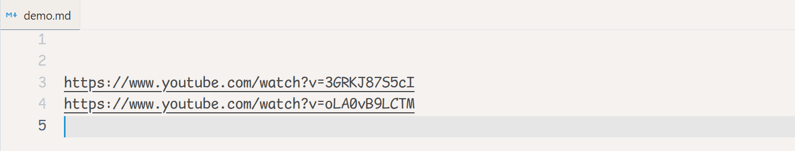

<!-- COMMANDS_START -->
## Commands (1)

|Command|Description|
|-|-|
|urlTitle.run|Url Title: Run|
<!-- COMMANDS_END -->

<!-- SETTINGS_START -->
## Settings (3)

|Setting|Default|Description|
|-|-|-|
|urlTitle.replaceExistingTitle|**true**|When checked - and the markdown link already has brackets & title - still fetch the new title and replace the old one.|
|urlTitle.removeDomainFromTitle|**true**|When checked - try to remove the domain name from the end of the title.|
|urlTitle.removeFromTitle|\[\]|Always remove these strings from the fetched title.|
<!-- SETTINGS_END -->